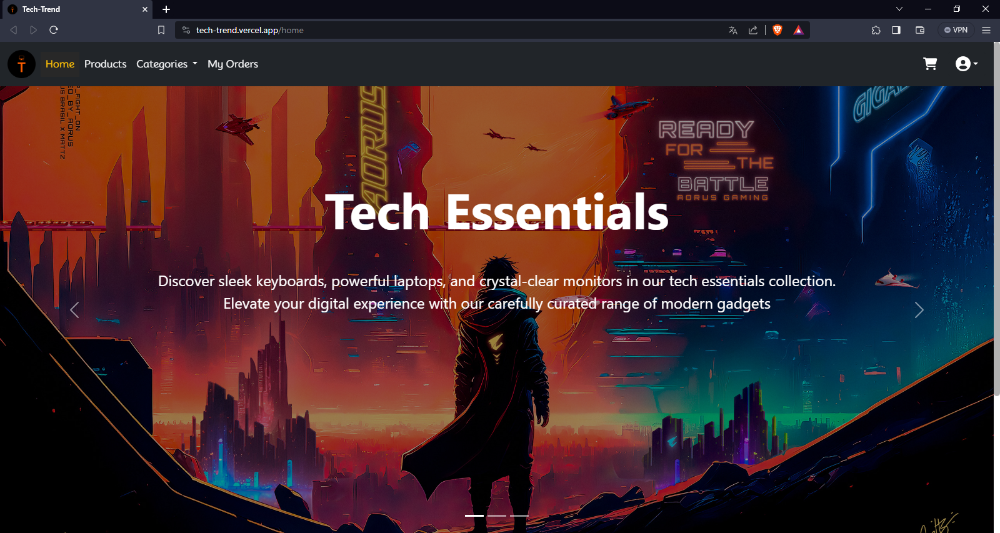

# 🟠 Tech-Trend Online Store

🚀 **Welcome to Tech-Trend!**



> [!TIP]
> Explore a range of cutting-edge products with our user-friendly interface.

## Overview

Tech-Trend is a sleek online store developed with the MEAN stack, offering a seamless shopping experience powered by Angular, Express, MongoDB, and Node.js. The platform integrates services like Cloudinary for image uploads and Paypal for proccess payments.

> [!IMPORTANT]
> **Admins play a key role:** they manage users, categories and product uploads to keep our inventory up to date (to create one register normally and in your database change the role).

## Key Features

- **User-Friendly Shopping:**
  - Browse products effortlessly.
  - Manage your cart seamlessly.

- **Admin Powers:**
  - Conduct CRUD operations.
  - Load new products dynamically.

- **Order Tracking:**
  - View your purchase history conveniently.

- **Secure Transactions:**
  - Paypal integration for safe payments.

- **Image Uploads:**
  - Cloudinary ensures visually appealing products.

> [!CAUTION]
> While enjoying our platform, be careful with sensitive information during transactions, use Paypal API sandbox accounts and not a real one.

## Technologies Used

- **Frontend:**
  - Angular V15.2.0

- **Backend:**
  - Express & Node.js: 18.0.0
  - MongoDB: Our reliable database.

- **Authentication:**
  - JSON Web Tokens (JWT): Ensures secure access.

- **External Services:**
  - Cloudinary: For stunning product visuals.
  - Paypal: Ensuring trustworthy transactions.

> [!WARNING]
> Keep your credentials secure, especially those of Mongo, Cloudinary and Paypal.

## Getting Started

### Backend Configuration

Create a `.env` file in the `back-end` folder with the following content:

```env
# Environment Config
NODE_ENV=your_node_env

# Server Port
PORT=8080

# URLs for Development and Production Environments
BACKEND_URL_DEVELOPMENT=http://localhost:8080
BACKEND_URL_PRODUCTION=your_backend_url_production

FRONTEND_URL_DEVELOPMENT=http://localhost:4200
FRONTEND_URL_PRODUCTION=your_frontend_url_production

# MongoDB Configuration
DB_USER=your_db_user
DB_PASSWORD=your_db_password
DB_CLUSTER=your_db_cluster
DB_DATABASE=your_db_database

# Cloudinary Credentials
CLOUDINARY_CLOUD_NAME=your_cloudinary_cloud_name
CLOUDINARY_API_KEY=your_cloudinary_api_key
CLOUDINARY_API_SECRET=your_cloudinary_api_secret

# Paypal Credentials
PAYPAL_API_CLIENT=your_paypal_client_id
PAYPAL_API_SECRET=your_paypal_api_secret

# Secret Key for JWT Auth
JWT_SECRET=your_secret_key
```

### Frontend Configuration

Create a `.env` file in the `front-end` folder with the following content:

```env
# Environment Config
NG_APP_ANGULAR_ENV=your_angular_env

# URLs for Development and Production Environments
NG_APP_BACKEND_URL_DEVELOPMENT=http://localhost:8080/
NG_APP_BACKEND_URL_PRODUCTION=your_backend_url_production

NG_APP_FRONTEND_URL_DEVELOPMENT=http://localhost:4200/
NG_APP_FRONTEND_URL_PRODUCTION=your_frontend_url_production
```

> [!NOTE]
> ### Contribution
>
> 1. Fork the repository.
> 2. Create a new branch: `git checkout -b feature/new-feature`.
> 3. Make changes and commit: `git commit -m "Description of the change"`.
> 4. Push changes to your fork: `git push origin feature/new-feature`.
> 5. Open a pull request for review.
>
> ### Contact
>
> For questions or suggestions, contact me at [martincruz1426@gmail.com](mailto:martincruz1426@gmail.com).
> 
> **Thank you for contributing to Tech-Trend! 🛒💻**